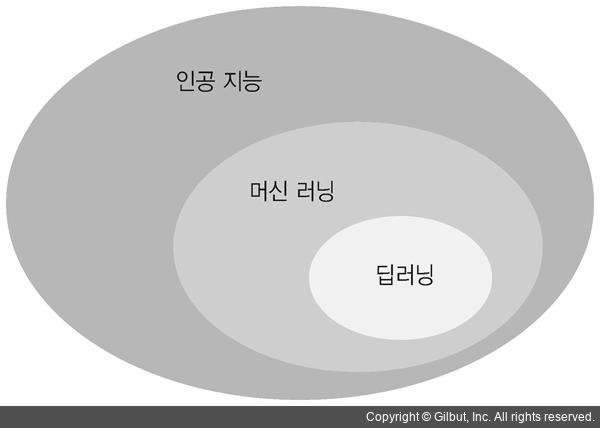
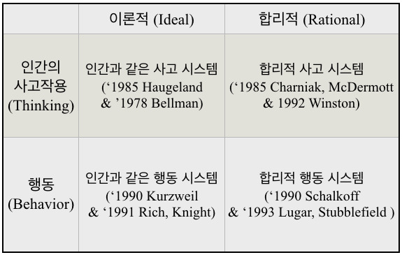
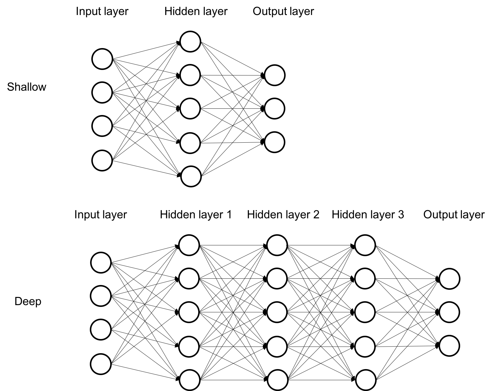

딥러닝이라는 용어를 정의하기 위해선 그 전에 인공지능, 머신러닝부터 짚고 넘어가야 한다. 딥러닝이 그 안에 있기 때문이다.

인공지능은 인간이 수행하는 학습, 추론, 지각 등 지능적인 작업을 인공적으로 구현하려는 컴퓨터 공학 분야이다. “인공지능: 현대적 접근법”이라는 책에서는 인공지능을 4가지 영역으로 정의한다. 인간처럼 생각하는 시스템, 인간처럼 행동하는 시스템, 이성적으로 생각하는 시스템, 이성적으로 행동하는 시스템. 인간처럼은 사람이 연구 대상이며 시스템이 사람을 완벽히 따라한다면 성공으로 간주할 수 있다. 이성적인 시스템으로 접근하는 것은 인간 역시도 이성적이지 않다는 가정을 통해 접근하는 것이며 사변적이다. ‘생각하는’ 접근법은 심리학과 논리학을 중심으로 생각 과정이 어떻게 작동하는지를 연구한다. 반면 ‘행동하는’ 접근법은 직관적으로 관찰 가능한 행동을 얼마나 잘 모방하는지에 따라 성공 여부가 결정된다.

머신러닝이라는 용어는 아서 사무엘이 논문에서 처음으로 사용했는데, 그는 이를 컴퓨터가 명시적으로 프로그래밍되지 않고도 학습할 수 있도록 하는 연구 분야라고 정의하였다. 최근 더 많이 사용되는 정의는 톰 미첼의 정의인데, 그는 “작업 T를 수행할 때 경험 E를 통해 성능 측정 방법인 P로 측정했을 때 성능이 향상된다면 이런 컴퓨터 프로그램은 학습했다고 말할 수 있다”라고 프로그램 학습을 정의하였다.

 

딥러닝은 여러 층을 가진 인공신경망을 사용하여 머신러닝 학습을 수행하는 것으로, 뇌 신경망에서 영감을 받아 만들어진 방식이다. 기존 머신러닝은 학습하려는 데이터의 특징 중에서 어떤 특징을 추출할지를 사람이 직접 찾아내야 했다. 하지만 딥러닝에서는 기계가 스스로 학습하여 데이터에서 특징을 추출한다. 예를 들어 개와 고양이를 구별하는 태스크를 수행할 때, 머신러닝은 사람이 개와 고양이의 특성을 정의하고 데이터세트를 만들고 나면, 컴퓨터가 이를 기반으로 동물을 구별하는 판별식을 결정하였다. 반면 딥러닝은 컴퓨터가 개와 고양이를 보고 스스로 특성을 찾아내고 판별하는 방법이다. 이러한 딥러닝의 특성은 인간이 특징을 추출하기 어려운 데이터에 특히 강점을 보인다.

​    

러닝의 앞에 붙어 있는 딥이라는 말은 신경망의 층이 많으며 그 안에 변수가 많다는 의미이다. 층이 2~3개로 구성된 신경망은 쉘로우 러닝(Shallow Learning)이라고 하며 그 이상부터를 딥러닝이라고 한다. 각 층에는 신경계의 뉴런에 해당하는 노드들이 존재하는데, 이들 각각이 하는 일은 매우 단순하다. 그렇기 때문에 쉘로우 러닝과 같은 방식은 폭넓게 활용되기에는 제한이 있다. 복잡한 문제를 해결하려면 층과 노드 간의 연결 가지 수가 많아져야 한다. 하지만 이때도 문제는 존재한다. 층과 연결가지 수가 증가할수록 연산에 필요한 계산량이 증가하는데, 경우에 따라서는 컴퓨터로 계산하는데 매우 오랜 시간이 걸리거나 아예 계산하지 못할 수도 있다.

