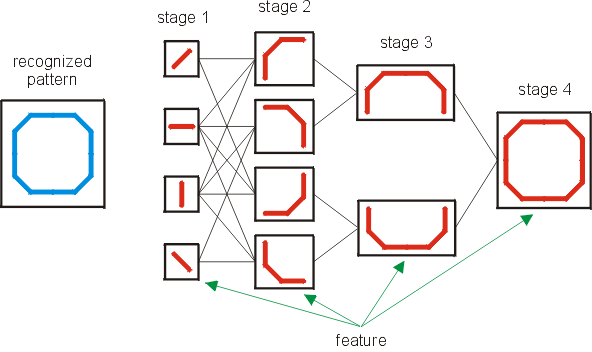
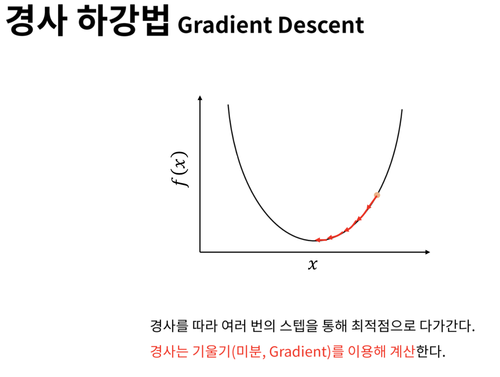

딥러닝은 머신러닝의 3가지 패러다임 중 하나인 신경 모형 패러다임에서 탄생하였다. 로버트 로센블래트가 1958년에 퍼셉트론 이론을 발표한 이후로 신경 모형 패러다임은 다양한 장애물로 인해 큰 진전을 보지 못하고 있었다.

1965년 이박넨코와 라파는 GMDH(Group Method of Data Handling)라는 딥러닝 시스템을 제시한다. 이는 기존에 사용하던 활성화 함수 대신 ‘Kolmogorov-Gabor’ 다항식을 사용한 활성화 함수가 제시되었다. 이는 처음에는 학습 데이터세트를 통해 은닉층을 확대함으로써 학습 시키고 이후 검증 데이터세트로 불필요한 신경망을 없애버리는 기법이다.

1979년 쿠니히코 후쿠시마는 네오코그니트론 모델을 개발했는데, 이는 처음으로 신경생리학 지식을 접목한 인공신경망이다. 후쿠시마의 연구는 데이비드 허블과 트르스텐 위젤의 고양이 시각 과정에서 뇌의 지각 피질의 동작 구조 연구로부터 영향을 받았는데, 그래서인지 나중에 이미지 인식 분야에 큰 영향을 끼쳤다.

1974년 폴 워보스는 경사감소법 기반의 역전파 기법을 신경망에 적용하였다. 경사감소법은 학습모델의 가중치를 결정하는 방법으로, 가중치를 포함한 피드포워드 함수값이 예상하는 값과 레이블된 실제값과의 차이를 최소화하는 가중치를 찾는 방법이다. 실제값과 예상값의 차이는 에러로 정의되는데, 에러를 제곱한 값을 함수로 나타내면 포물선 모양의 2차 평면에 표현될 수 있다. 해당 모형에서 최저점을 찾는 게 목적이며 이런 과정이 경사진 언덕을 내려가는 것과 같다고 하여 경사감소법이라고 부른다.

그러나 경사감소법에도 문제는 존재하였다. 층이 많은 신경망에서 최적해에 수렴하지 못하고실패하는 문제가 자주 발생하였으며, 또한 경사도가 급격히 감소하거나 계산 영역을 벗어나는 장기 지연 문제도 있었다. 그래서 막상 딥러닝보다는 쉘로우 러닝 문제에서 많이 활용되었다.

1991년에 경사감소법의 문제를 해결하기 위해 셉 호크라이터는 출력층의 정보를 메모리에 저장하여 역전파에 사용하는 장단기 기억법(LTSM: Long Short-Term Memory) 개발하였다. 이는 경사도가 급격히 감소하다가 소멸하는 문제를 해결하였다. 이후 그의 지도학생인 유어겐 슈미츠후버는 1992년에 장단기 기억법을 개선하여 순환신경망(RNN: Recurrent Neural Network)을 만들었다. 이는 결과값을 지도학습으로 역전파하기 전에, 초기부터 중간층까지는 합리적인 비지도학습을 진행하여 불확실한 중간층의 개수를 최소화하는 방법이다.

2006년 제프리 힌튼, 사이먼 오신데로, 이-화이 테는 심층신뢰망(DBN: Deep Belief Network)을 개발하였다. 이는 순환신경망과 유사한데, 많은 전문가들은 해당 알고리즘이 딥러닝을 다시 부흥시키는 계기가 되었다고 평가한다. 심층신뢰망은 제한된 볼츠만 머신(RBM: Restricted Boltmann Machine)이라는 사전 학습 방법을 통해 경사감소소멸 문제를 해결하였다. RBM은 볼츠만 머신으로부터 파생되었는데, 이들은 대칭으로 연결된 입력노드와 은닉 노드 중 의미있는 연결이 어느 것인지를 확률적으로 판단한다는 점에서 공통점을 갖는다. 다만 RBM은 입력층에서 은닉층으로의 연결만 허용되지만, 볼츠만 머신은 층 내부의 노드 간에도 연결이 가능하다는 점에서 다르다. RBM 역시 에러의 정보 손실을 최소화하는 게 목적이다. 

2010년대 들어서 ReLU라는 활성화 함수와 드롭아웃 알고리즘이 개발되면서 딥러닝의 발전이 이루어졌다. 우선 ReLU 함수에 대한 설명부터 하자면, 이는 입력값이 0보다 작으면 함수값이 0이되고, 0보다 크면 ax+b와 같은 1차함수 형태를 띄는 활성화 함수이다. 이런 함수를 사용하게 된 것은 신경과학자들이 뉴런이 신호를 보낼 때 시그모이드 함수보다는 ReLU 형태의 함수를 선호한다는 사실을 밝혀냈기 때문이다. 여기서 영감을 얻어 인공신경망 학자들은 이를 알고리즘에도 적용하기 시작하였다. ReLU 함수는 경사감소소멸 현상을 줄이는 데, 그 이유는 시그모이드 함수의 1차 미분값은 입력값이 커지면 급격히 줄어들지만 ReLU는 일정한 상수값을 유지하기 때문이다.

드롭아웃 알고리즘은 2012는 제프리 힌튼이 과적합 문제를 해결하기 위해 발표한 알고리즘이다. 과정합은 머신러닝에서 노이즈까지 포함되어있는 데이터를 과도하게 학습한 모델이 되려 정확성이 떨어지는 현상을 의미한다. 딥러닝 학습 과정에서 어떤 노드는 이전 층에 있는 어떤 특정 노드의 출력값에 민감히 반응할 때가 있는데, 이 둘이 연결되면 과적합 문제를 유발할 가능성이 크다. 특히 학습 데이터의 규모가 작을수록 더 그렇다. 드롭아웃 알고리즘은 이런 연결을 배제해서 과적합을 줄이다. 그 개념에 대해서 설명하자면, 먼저 각층의 노드를 제거할 확률을 정하는데 보통 P라고 부르며 0.5를 사용한다. P값에 맞게 각층의 노드를 임의로 제거한 후 축소된 신경망으로 피드포워드 기반의 역전파 방식으로 학습한다. 학습된 후 테스트를 할 때는 원래대로 모든 노드를 고려하고 노드마다 가지고 있는 가중치에 P값을 곱한다. 이는 앞 단계에서 확률 P로 드롭아웃된 노드로 학습한 결과를 보상하는 것이다.